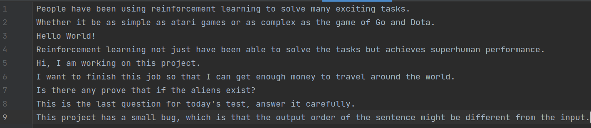
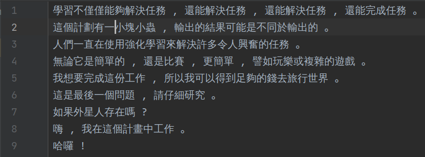

# ml-translation
A RNN or Transformer model for translation

Build to train model to translate from English to Chinese, 
able to be modified to do other translation

The encoder/decoder are set to be RNN encoder/decoder by default, can be changed to Transformer encoder/decoder

To train the model, reference the train.py file, to use the trained model, use the 
translate(src, output_path="./output.txt", from_file=False, output_to_file=False) method in the
file use_model.py.

Following shows the input and output of a trained RNN model, with default 
parameter values.

Known bugs:   
The output order of the sentence might be different from the input.
